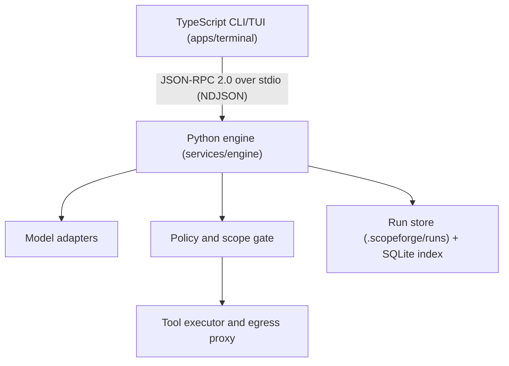

# Architecture

Two local processes, one policy boundary. See `plan.md` §5 + ADRs 01–06.

## Trust boundary

Only `services/engine` may open target sockets or spawn security tools.
`apps/terminal` has no HTTP client to targets and no subprocess execution of tools.
Policy checks (plan.md §7.2, 12 steps) run deterministically in the engine before
any executor receives a short-lived single-purpose capability. Prompts cannot mint
capabilities or broaden scope. See `docs/threat-model.md`, `docs/authorization.md`.

## Protocol

`packages/protocol-schema/` is the source of truth. `pnpm generate:protocol`
regenerates `packages/protocol-ts/src/generated.ts` and
`services/engine/src/scopeforge_engine/protocol_generated.py` plus JSON fixtures
in `tests/contract/fixtures/`. Generated files are checked in; drift fails CI.

Envelope: `protocol_version`, `trace_id`, `ts`, `run_id?`, `seq` (events),
redaction classification. Major mismatch fails closed; minor negotiates.

## Run store

Portable files authoritative; SQLite rebuildable. Layout per ADR-03.
`cases.jsonl` / `events.jsonl` / `audit.jsonl` append-only + fsync at checkpoints.

## Dependency rules

domain ← policy ← executors (capability-gated); providers never call tools;
UI never duplicates policy logic. Enforced by import lints + review.
