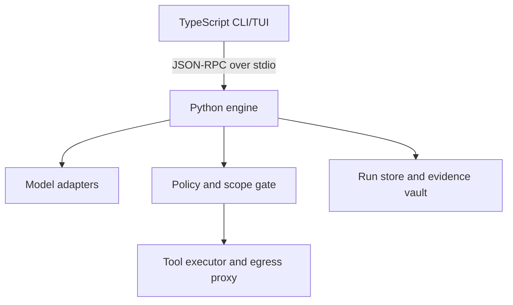
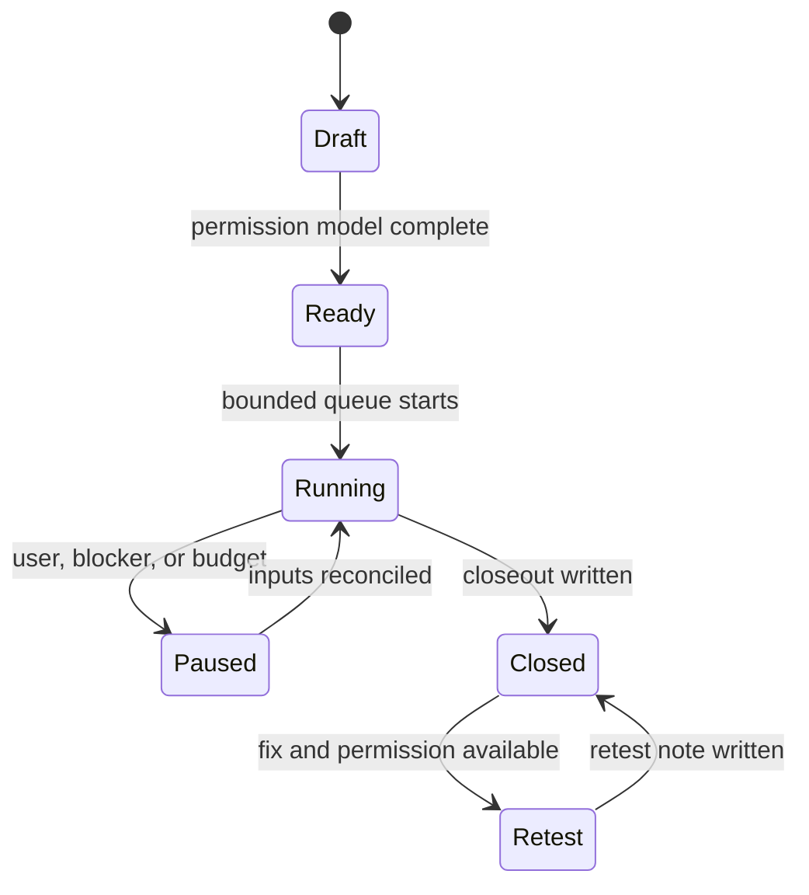

# ScopeForge — Implementation Plan

> Working name for an independent, open-source, model-agnostic CLI/TUI agent harness for **authorized bug-bounty research and deliberate practice**. Rename after checking package, repository, and trademark availability.

**Status:** implementation-ready product and engineering plan  
**Date:** 2026-09-15  
**Primary languages:** TypeScript and Python  
**License target:** Apache-2.0  
**Execution context for this document:** plan only; no target systems were contacted

---

## 1. Executive decision

Build ScopeForge as two local processes:

1. A **TypeScript CLI/TUI** owns the terminal experience, session navigation, streaming display, approvals, diffs, and command parsing.
2. A **Python engine** owns agent orchestration, model adapters, authorization and scope enforcement, tool execution, evidence, run state, coaching, and reports.
3. A versioned **JSON-RPC 2.0 protocol over newline-delimited stdio** connects them. The protocol is generated from shared JSON Schemas. Remote transport is not part of the MVP.

This split gives TypeScript the UI work it is best suited to and keeps Python close to the security, HTTP, parsing, automation, and evaluation ecosystem. The Python process is the only component allowed to execute a security tool or contact a target, so there is one enforceable policy boundary.

ScopeForge should feel as immediate as OpenCode and as provider-flexible as a modern model harness, but its core object is not a chat. Its core object is an **authorized engagement containing falsifiable test cases and evidence**.

### Product promise

> Turn an authorized program and researcher-controlled fixtures into a bounded queue of experiments, preserve evidence, challenge weak conclusions, and teach the user to produce reproducible reports.

### What “all-model support” means

“All models” is an extensibility goal, not a claim that every provider exposes the same features. ScopeForge will:

- normalize streaming text, structured output, tool calls, reasoning controls, images, token usage, and errors;
- negotiate capabilities per model instead of guessing from a model name;
- support custom OpenAI-compatible and Anthropic-compatible base URLs;
- ship native adapters for the most important APIs;
- offer an optional LiteLLM bridge for long-tail providers;
- degrade visibly when a model lacks a required capability;
- never silently emulate a security-critical capability.

---

## 2. Goals, users, and non-goals

### Goals

- Provide a polished interactive TUI and a scriptable, non-interactive CLI.
- Support hosted and local models without locking run state to one provider.
- Make plan-only, artifact-only, and live execution visibly different modes.
- Enforce authorization, target scope, method constraints, redirects, request budgets, rate limits, and stop conditions before network I/O.
- Structure work as scope → recon/model → plan → test → validate → report → retest/closeout.
- Cover web and API research first, using twelve explicit security categories.
- Record negative observations, blocked cases, inconclusive leads, and validated findings without conflating them.
- Make every material model suggestion traceable to evidence or clearly marked as inference.
- Help a learner improve hypothesis design, control selection, evidence quality, and report writing.
- Be local-first, inspectable, reproducible, and useful without telemetry.

### Primary users

- A learner practicing on local labs and intentionally vulnerable applications.
- An independent researcher working under a published bug-bounty policy.
- An application-security engineer testing an explicitly authorized internal environment.
- A report reviewer validating supplied artifacts without live target contact.

### Non-goals for v1

- Selecting targets or deciding that an asset is authorized.
- Autonomous internet-wide discovery, mass scanning, credential attacks, persistence, stealth, evasion, exploitation at scale, or destructive proof.
- Automatically claiming cloud resources, dangling domains, or third-party infrastructure.
- Automatic vulnerability submission or public disclosure.
- Replacing Burp Suite, mitmproxy, Nuclei, browser developer tools, or a skilled researcher.
- Mobile, hardware, desktop, cloud-control-plane, smart-contract, or AI red-team coverage in the web/API MVP.
- A hosted multi-tenant control plane.
- Multi-agent swarms in the MVP. A transparent single orchestrator with named workflow roles is easier to audit and teach.

---

## 3. Design principles

1. **Permission is data, not a checkbox.** Every live action carries a reference to the policy snapshot and the exact asset/method decision that permits it.
2. **Plan mode has zero target egress.** Documentation retrieval is separate and must never accidentally become target contact.
3. **A lead is not a finding.** Status transitions require evidence and validation criteria.
4. **One changed variable per experiment.** The system asks for an expected rule, baseline, changed variable, observable result, and stopping point.
5. **The model proposes; deterministic code permits and executes.** Prompts cannot override the policy engine.
6. **Target content is untrusted evidence.** Pages, tool output, repository text, and MCP descriptions never become authority.
7. **Budgets are enforced below the agent.** The HTTP and subprocess layers own counters, concurrency, timeout, and cancellation.
8. **Local-first and inspectable.** Runs are readable files plus SQLite indexes; no proprietary state format is required to recover the work.
9. **Capability-based model routing.** Models are selected for required features, cost, latency, and user preference—not brand assumptions.
10. **Teach the method, not payload memorization.** Coaching rewards product understanding and minimum sufficient proof.

---

## 4. User experience

### 4.1 TUI layout

Use OpenTUI with React bindings after a two-day spike verifies Windows Terminal, tmux, SSH, screen readers, Unicode fallback, scrollback, and large streamed output.

```text
┌ Run / mode / model / budget ───────────────────────────────────────────────┐
│ Scope & queue        │ Conversation / experiment                           │
│                      │                                                      │
│ T02 Authorization 4/9│ Model proposal, tool preview, result, reasoning      │
│ T05 API surface   2/6│                                                      │
│ T09 Files         1/4│                                                      │
├──────────────────────┼──────────────────────────────────────────────────────┤
│ Evidence / findings  │ Composer                                             │
│ E-014 request diff   │ Ask, plan, create case, or issue a slash command      │
└ Status: artifacts · no target egress · 0/0 requests ────────────────────────┘
```

Required views:

- **Run switcher:** recent, pinned, resumable, blocked, and awaiting-fix runs.
- **Authorization & scope:** policy source/date, included assets, exclusions, methods, windows, data rules, and unresolved decisions.
- **Coverage:** categories → checks → concrete cases, with applicability and result status.
- **Conversation:** streamed model output with collapsed internal events and explicit evidence citations.
- **Experiment diff:** baseline and variant requests/responses with secret redaction.
- **Approval modal:** exact tool, destination, method, request estimate, side effects, and permission basis.
- **Evidence browser:** immutable originals, derived/redacted copies, hashes, timestamps, and case links.
- **Finding editor:** proof checklist, missing evidence, severity rationale, and report preview.
- **Coach:** hint level, rubric feedback, mastery map, and next lab recommendation.
- **Model inspector:** provider, endpoint class, capabilities, context limits, current cost/usage, and fallback chain.
- **Command palette:** fuzzy search over actions and keybindings.

Accessibility requirements:

- complete keyboard operation;
- no meaning conveyed by color alone;
- high-contrast and monochrome themes;
- reduced-motion mode;
- ASCII-safe symbols when Unicode is unavailable;
- useful plain CLI output when TTY features are unavailable;
- `--json` and `--no-color` on all scriptable commands.

### 4.2 CLI command surface

The binary name below is provisional.

```bash
scopeforge init
scopeforge doctor
scopeforge tui [--run RUN_ID]

scopeforge provider add
scopeforge provider test PROVIDER
scopeforge models list [--capability tools]
scopeforge models inspect MODEL

scopeforge program import POLICY_FILE_OR_URL
scopeforge scope show
scopeforge scope validate HOST_OR_URL

scopeforge run start --mode plan|artifacts|live [--categories T02,T05]
scopeforge run resume RUN_ID
scopeforge run status RUN_ID [--json]
scopeforge run cancel RUN_ID
scopeforge run close RUN_ID

scopeforge case new --check T02.1
scopeforge case list [--result lead]
scopeforge case show CASE_ID
scopeforge case retry CASE_ID

scopeforge artifact import FILE...
scopeforge evidence show EVIDENCE_ID
scopeforge evidence redact EVIDENCE_ID
scopeforge report build FINDING_ID --format markdown

scopeforge tools list
scopeforge tools inspect TOOL
scopeforge mcp add|list|disable
scopeforge eval run SUITE
scopeforge export RUN_ID --redacted
```

Behavioral rules:

- `run start --mode live` opens the scope review and refuses to proceed if permission inputs are incomplete.
- `--yes` may suppress low-risk local confirmations but can never bypass live target, credential, destructive-effect, or policy gates.
- Exit codes are stable and documented: success, invalid config, policy blocked, approval declined, provider failure, tool failure, budget exhausted, and partial/inconclusive.
- `--json` emits versioned objects to stdout; diagnostics go to stderr.

### 4.3 First-run flow

1. Explain local storage and the distinction between plan, artifacts, and live modes.
2. Configure a provider or choose a local model.
3. Run a capability probe using a harmless local tool.
4. Offer either a local training lab or policy import.
5. Create the first run with a visible request budget of zero in plan/artifact mode.
6. Teach one complete case: rule → baseline → changed variable → evidence → conclusion.

---

## 5. System architecture



### 5.1 TypeScript terminal client

Responsibilities:

- CLI parsing and completion;
- TUI rendering, keyboard/mouse input, themes, and accessibility;
- protocol lifecycle, reconnect/restart, cancellation, and backpressure;
- event projection into UI state;
- approval and elicitation screens;
- local display redaction as defense in depth;
- PTY-safe streaming and log export;
- no direct target network client and no security-tool subprocess execution.

Recommended stack:

- TypeScript in strict mode;
- Node.js current LTS baseline;
- OpenTUI React after the compatibility spike;
- `commander` or `clipanion` for non-interactive commands;
- `zod` only at untrusted UI boundaries; generated protocol types remain authoritative;
- Vitest for unit/contract tests;
- `tsup` or `pkgroll` for packages;
- pnpm workspaces.

### 5.2 Python engine

Responsibilities:

- event-sourced agent loop and state machine;
- provider routing and capability normalization;
- tool registry, schema validation, approvals, sandboxing, and cancellation;
- engagement, scope, method, target, redirect, DNS, and budget enforcement;
- HTTP capture and controlled browser orchestration;
- artifact parsing, evidence hashing/redaction, and report generation;
- coaching, rubric scoring, evaluations, and local knowledge packs;
- SQLite projections plus portable JSON/JSONL/Markdown run files.

Recommended stack:

- Python 3.12+;
- `uv` for environments, lock, build, and workspace management;
- Pydantic v2 for domain and protocol validation;
- `anyio` for structured concurrency and cancellation;
- `httpx` for guarded HTTP;
- SQLAlchemy 2 + Alembic for SQLite indexes;
- `orjson` where profiling justifies it;
- `keyring` for OS credential-store integration;
- `pytest`, `pytest-asyncio`, Hypothesis, and respx;
- Playwright only in the opt-in browser extra;
- Rich is allowed for engine diagnostics, never as a second TUI.

### 5.3 Protocol

Use JSON-RPC 2.0 messages, UTF-8, one message per line. Reserve stderr for logs. Every message includes:

- `protocol_version`;
- `run_id`, when applicable;
- `request_id` or event sequence;
- `trace_id` and parent span/event;
- timestamp in UTC;
- redaction classification;
- schema discriminator.

Core methods/events:

- `initialize`, `capabilities`, `shutdown`, `health`;
- `run.create`, `run.resume`, `run.cancel`, `run.close`;
- `chat.submit`, `case.create`, `case.execute`, `case.update`;
- `approval.respond`, `elicitation.respond`;
- `provider.list`, `model.list`, `model.probe`;
- `tool.list`, `tool.preview`, `tool.execute`;
- `artifact.import`, `report.render`, `export.create`;
- events: `token.delta`, `reasoning.summary`, `tool.proposed`, `approval.required`, `tool.started`, `tool.progress`, `tool.finished`, `evidence.created`, `case.changed`, `budget.changed`, `warning`, `error`, and `run.checkpointed`.

Protocol requirements:

- unknown fields are preserved where practical; unknown event types are ignored with a warning;
- major versions reject incompatibility; minor versions negotiate capabilities;
- streamed events are ordered per run using a monotonic sequence;
- reconnect replays from `last_seen_sequence`;
- bounded in-memory queues apply backpressure;
- cancellation propagates to model stream, browser context, HTTP request, and subprocess group;
- tool output is referenced as an artifact when it exceeds the event size limit.

### 5.4 Run store

Portable files are authoritative evidence; SQLite is a rebuildable index and UI projection.

```text
.scopeforge/
├── config.toml
├── providers.toml                 # secret references only
├── policy/
│   └── defaults.toml
└── runs/<run-id>/
    ├── engagement.json
    ├── run-state.json
    ├── coverage.json
    ├── cases.jsonl
    ├── events.jsonl
    ├── model-usage.jsonl
    ├── audit.jsonl
    ├── artifacts/original/
    ├── artifacts/derived/
    ├── evidence/<evidence-id>/metadata.json
    ├── findings/<finding-id>/report.md
    └── summary.md
```

Rules:

- original imported artifacts are immutable after ingestion;
- SHA-256 hashes identify bytes; derived files record source hash and transformation;
- secrets are referenced by key name or vault URI, never copied into run records;
- JSONL writes are append-only and `fsync` at checkpoints;
- compact projections are replaced atomically;
- a lock prevents two engines from mutating the same run;
- export defaults to redacted derived artifacts, not originals;
- retention is explicit; deletion names the exact run and shows unrecoverable evidence impact.

---

## 6. Domain model and workflow

### 6.1 Engagement

`engagement.json` must record:

- program name and policy source;
- policy retrieval/import timestamp and effective date, if known;
- user intent and execution mode;
- authorization basis;
- included assets and exact match rules;
- exclusions and third-party boundaries;
- permitted/prohibited methods;
- automation, concurrency, rate, request, time, and cost limits;
- testing window and timezone;
- required request headers or researcher identifiers;
- allowed account types, roles, tenants, and fixture references;
- data handling, evidence retention, disclosure, and reporting rules;
- credential references and tool capability snapshot;
- unresolved questions and blockers.

An empty scope means **unknown**, never unrestricted. A missing numeric limit means **unknown**, never unlimited.

### 6.2 Coverage

Start with these twelve web/API categories:

| ID | Category | Minimum modeling question |
|---|---|---|
| T01 | Authentication and identity | Which flow establishes, recovers, links, or steps up identity? |
| T02 | Authorization and tenancy | Which actor may perform which action on which object and tenant? |
| T03 | Sessions and tokens | What is the token purpose and lifecycle? |
| T04 | Business logic and state | Which server-enforced invariant or transition must hold? |
| T05 | API surface and protocols | Do methods, versions, schemas, and protocols enforce equivalent rules? |
| T06 | Browser execution | Can controlled input reach an executable browser context? |
| T07 | Origins and integrations | Where does trust cross origins, frames, messages, callbacks, or providers? |
| T08 | Server-side input | Which parser, query, template, or command boundary interprets input? |
| T09 | Files, URLs and processors | How are files, paths, archives, fetches, and conversions bounded? |
| T10 | Deployment and exposure | Is exposed behavior reachable, in scope, and practically impactful? |
| T11 | HTTP, proxies and caches | Do routing, parsing, and cache layers agree, with safe isolation? |
| T12 | Data, errors and cryptography | What confidentiality or integrity rule protects the data? |

Applicability values: `not_assessed`, `applicable`, `not_applicable`, and `blocked`. A blocked check is neither tested nor not applicable.

### 6.3 Concrete case

Every executed case requires:

```json
{
  "case_id": "C-0001",
  "check_id": "T02.1",
  "asset": "https://authorized.example",
  "feature": "project export",
  "actor_ref": "account-b",
  "role": "member",
  "tenant_ref": "tenant-b",
  "object_ref": "fixture-owned-by-account-a",
  "workflow_state": "active",
  "hypothesis": "A member from tenant B can export tenant A's project",
  "expected_rule": "Only project members in the owning tenant may export",
  "baseline": "Account A exports its own synthetic fixture",
  "changed_variable": "Authenticate as account B and keep the object reference",
  "observable_result": "Server denies access and returns no project data",
  "stopping_point": "One controlled export attempt after one baseline",
  "permission_ref": "P-2026-09-15",
  "result": "queued",
  "evidence_refs": [],
  "observed_behavior": null,
  "inferred_impact": null,
  "next_action": "capture baseline"
}
```

Result values:

- `queued`;
- `tested_no_issue_observed`;
- `lead`;
- `validated_finding`;
- `false_positive`;
- `blocked`;
- `inconclusive`.

An executed result requires an observation timestamp and evidence reference. A scanner alert, version string, reflection, status code, or schema alone never transitions to `validated_finding`.

### 6.4 Finding proof gate

A finding can become validated only when all applicable checks pass:

- exact in-scope asset and permission reference;
- intended security rule stated;
- controlled identity and fixture ownership known;
- baseline and one-variable variant captured;
- behavior reproduced from clean state where relevant;
- harmless minimum proof demonstrates the failed boundary;
- alternative explanations considered and resolved;
- demonstrated impact separated from inferred consequence;
- unrelated user data was not accessed or retained;
- evidence is redacted and replayable enough for triage;
- stopping point was honored.

### 6.5 Run state machine



Stages inside a run: scope, recon, model, plan, test, validate, report, retest, and closeout. Stage states: `pending`, `in_progress`, `completed`, `blocked`, and `not_requested`.

---

## 7. Authorization, scope, and safety architecture

### 7.1 Execution modes

| Mode | Target contact | Permitted work |
|---|---:|---|
| `plan` | Never | Policy parsing, product modeling from supplied docs, case design, curriculum, local references |
| `artifacts` | Never | Analyze supplied code, HAR, requests, responses, screenshots, logs, schemas, and reports |
| `live` | Only after policy gate | Bounded requests to exact authorized destinations using permitted methods |

The mode badge must remain visible in the TUI. Switching to `live` is a persisted state transition with a review screen, not a prompt instruction.

### 7.2 Policy decision pipeline

Every proposed side effect passes deterministic checks in this order:

1. **Run mode:** is live target contact enabled?
2. **Policy freshness:** is the operative source/date present, and does the user need to re-confirm a material change?
3. **Asset match:** does the canonical scheme/host/port/path match an included rule and no exclusion?
4. **DNS resolution:** are all resolved addresses allowed for this asset? Re-resolve safely and defend against rebinding.
5. **Redirect destination:** is each hop independently in scope? Never forward credentials across an unapproved origin.
6. **Method and tool:** are the HTTP method, browser action, scanner mode, and payload class permitted?
7. **Identity and fixture:** are the account, tenant, object, and callback endpoint researcher-controlled or explicitly supplied?
8. **Impact class:** does the case risk shared cache, queue, concurrency, money, messages, data modification, destructive effects, or unrelated users?
9. **Budget:** do request, rate, concurrency, duration, byte, token, and monetary counters have remaining capacity?
10. **Approval:** does the action require a one-shot or session approval?
11. **Execution token:** issue a short-lived, single-purpose capability to the executor.
12. **Postcondition:** record counts, destination, timing, output class, and any stop signal.

No approval token can skip checks 1–10. The executor rejects expired, replayed, broadened, or mismatched capabilities.

### 7.3 Scope matcher

- Canonicalize IDNA hostnames, scheme, default ports, dot segments, IPv4/IPv6, and trailing dots.
- Express scope as structured rules, not regex alone.
- Support exact hosts, explicitly declared subdomain patterns, CIDRs, ports, path prefixes, environments, and API versions.
- Deny ambiguous wildcard interpretation.
- Resolve CNAMEs and redirects without treating related infrastructure as permission.
- Block link-local, metadata, loopback, RFC1918, and Unix socket destinations unless the exact lab/internal asset is explicitly authorized.
- Pin the checked address through connection or use a policy-aware local egress proxy.
- Re-evaluate every redirect, browser navigation, WebSocket connection, callback, and tool-discovered URL.
- Strip `Authorization`, cookies, client certificates, and sensitive custom headers when the approved origin changes.

### 7.4 Budgets and stop conditions

Enforce combined manual and automated traffic:

- total request limit;
- per-host and per-route token buckets;
- maximum concurrency, default 1;
- wall-clock deadline;
- response byte ceiling;
- retry ceiling and no automatic retry for non-idempotent operations;
- model token and monetary ceilings;
- subprocess CPU, memory, file, and duration limits;
- browser page/context limit;
- user-defined stop words/status codes;
- automatic stop on throttling, block signals, authentication spill, unrelated user data, unexpected side effects, or scope drift.

If a program does not state a numeric limit, the UI asks the user to choose a conservative operating budget and labels it as the researcher's limit, not the program's rule.

### 7.5 Tool risk classes

| Class | Examples | Default |
|---|---|---|
| R0 local read | Read supplied file, parse schema, hash artifact | Allow inside run directory |
| R1 local write | Create derived artifact, report, or case | Allow with audit event |
| R2 bounded passive network | Fetch the exact policy/document URL | Confirm source and destination |
| R3 live target read | One authorized GET/HEAD or browser navigation | Policy gate + preview |
| R4 live state change | POST/PUT/PATCH/DELETE, upload, message, invitation | One-shot approval + fixture proof |
| R5 shared/high-impact | Concurrency, cache, parser desync, costly action | Disabled unless policy and isolation explicitly support it |
| R6 prohibited | Persistence, stealth, unrelated-data extraction, destructive proof, credential attacks | No built-in execution path |

### 7.6 Sandbox

- Built-in HTTP and browser tools run in the Python engine with egress mediated by policy.
- External binaries run in a rootless container or platform sandbox with a read-only root, dedicated scratch directory, no host network by default, bounded resources, and an allowlisted egress proxy.
- Never interpolate model text into a shell command. Use argument arrays and typed tool schemas.
- Tool manifests declare executable hashes/version ranges, filesystem access, egress needs, risk class, output parser, and cancellation behavior.
- Captured target content and tool descriptions are wrapped as untrusted data and cannot register tools or modify policy.
- MCP servers are disabled by default per run; users review server identity, exposed tools, data destinations, and permissions before enabling them.

---

## 8. Model-provider architecture

### 8.1 Canonical interface

```python
class ModelProvider(Protocol):
    async def list_models(self) -> list[ModelDescriptor]: ...
    async def probe(self, model: str) -> ModelCapabilities: ...
    async def stream(self, request: CanonicalRequest) -> AsyncIterator[ModelEvent]: ...
    async def count_tokens(self, request: CanonicalRequest) -> TokenEstimate: ...
    async def close(self) -> None: ...
```

Canonical capabilities:

- streaming text;
- client-side tool calling;
- parallel tool proposals;
- strict structured output / JSON Schema subset;
- image/file input;
- reasoning/effort controls and safe summary exposure;
- prompt caching;
- context and output limits;
- token accounting and price metadata;
- server-side tools, explicitly distinguished from local tools;
- cancellation semantics;
- data-retention/region metadata supplied by user configuration.

### 8.2 Adapter tiers

| Tier | Adapters | Release target |
|---|---|---|
| 1 | Generic OpenAI-compatible Chat/Responses endpoint; DeepSeek preset; generic Anthropic-compatible endpoint | MVP |
| 2 | Native OpenAI Responses, Anthropic Messages, Google Gemini, Ollama | MVP/beta |
| 3 | vLLM, LM Studio, OpenRouter, Azure OpenAI, Bedrock, Vertex presets | Beta |
| 4 | Optional LiteLLM bridge for long-tail providers | Beta |
| 5 | Community adapters through a stable plugin SDK | Post-1.0 |

DeepSeek belongs in Tier 1 because its official API supports OpenAI/Anthropic-compatible formats. Provider-specific fields such as reasoning controls must pass through a namespaced `provider_options` object and be shown in the model inspector.

### 8.3 Routing

Routing input:

- required capabilities;
- user allowlist/denylist;
- local-only/privacy requirement;
- maximum cost and latency preference;
- minimum context size;
- task class: plan, extraction, code, vision, tool use, validation critique, or report writing;
- provider health and rate limits.

Rules:

- no cross-provider fallback if it would send data to a destination the user did not approve;
- never downgrade from strict structured output or tool calling invisibly;
- record the exact provider, model, adapter version, parameters, usage, and fallback reason per turn;
- use idempotency keys when supported;
- retry only safe failures with exponential backoff and jitter;
- capability probes use local harmless tools and are cached with a TTL;
- model metadata is advisory until confirmed by a probe or provider response.

### 8.4 Secrets

- Prefer OS keychain/keyring entries.
- Support environment-variable references and external secret-command references with explicit configuration.
- Never print secret values, persist them to transcripts, or send them to a model.
- Redact authorization headers, cookies, tokens, signed URLs, and common credential shapes before model context construction.
- Warn before using a hosted model with sensitive artifacts; allow local-only run policies.
- Provide `scopeforge provider test` that reports only success, capabilities, and safe diagnostic codes.

---

## 9. Agent runtime

### 9.1 One orchestrator, explicit roles

The runtime is a deterministic loop with named prompt/tool profiles rather than hidden autonomous agents:

- **Scope analyst:** extracts policy facts and unresolved ambiguity.
- **Product modeler:** maps actors, objects, tenants, states, workflows, and trust boundaries.
- **Test designer:** creates falsifiable, bounded cases.
- **Research assistant:** proposes an approved next action.
- **Evidence analyst:** compares baseline and variant and lists alternative explanations.
- **Validator:** challenges whether the minimum proof establishes the claimed rule failure.
- **Report writer:** drafts only from validated evidence.
- **Coach:** scores researcher decisions and offers progressive hints.

Each role has a typed input/output schema and a tool allowlist. The policy engine remains outside every role.

### 9.2 Turn loop

1. Load the smallest relevant state projection.
2. Select role and required model capabilities.
3. Build a redacted context package with stable evidence references.
4. Request a typed proposal from the model.
5. Validate schema and semantic preconditions.
6. Run the deterministic policy decision.
7. If needed, show an exact approval preview.
8. Execute with a short-lived capability.
9. Ingest output as evidence or diagnostic artifact.
10. Ask the evidence analyst for a bounded interpretation.
11. Update the case and append events atomically.
12. Checkpoint usage, blockers, and next queue.

### 9.3 Context management

- Use structured summaries keyed by source event/evidence IDs.
- Keep policy, scope, permission, and current case in a pinned non-compressible context block.
- Never summarize a lead into a finding.
- Preserve facts, inferences, and model suggestions as different record types.
- Retrieve only artifacts attached to the current run and approved for the selected provider.
- Compact conversation by events, not arbitrary token slices.
- Record summary provenance and allow the user to inspect it.
- Do not maintain cross-project memory by default.

### 9.4 Tool system

MVP built-ins:

- safe filesystem read/list within approved roots;
- artifact import and type detection;
- HAR, raw HTTP, OpenAPI, GraphQL schema, JSON, text, source map, and archive parsing;
- request/response diff and normalization;
- secret and unrelated-data redaction;
- guarded HTTP request/replay;
- DNS/scope resolution;
- controlled Playwright browser capture;
- evidence snapshot/hash;
- report and summary render;
- local lab lifecycle helpers.

Later gated wrappers:

- user-installed Nuclei, httpx, katana, ffuf, dnsx/subfinder, semgrep, and similar tools;
- Burp/mitmproxy import or extension bridge;
- MCP tools;
- custom Python tools in signed/locally trusted packs.

Wrappers must constrain targets, arguments, concurrency, and output. Raw arbitrary shell remains a developer-only feature and is never exposed as a live bug-bounty tool in standard mode.

---

## 10. Evidence and reporting

### 10.1 Evidence object

Required metadata:

- evidence ID and content hash;
- source type and original/derived status;
- capture/import timestamp;
- tool and version;
- asset, actor, tenant, fixture, and case references;
- request method and canonical destination, when relevant;
- redaction state and transformation chain;
- MIME type and byte size;
- sensitivity label;
- short factual description with no severity claim.

### 10.2 HTTP evidence

- Store exact raw capture when allowed, plus a redacted report copy.
- Separate headers/body and maintain ordering when it matters.
- Normalize only in a derived copy.
- Show semantic diff for JSON, headers, cookies, HTML, GraphQL, and WebSocket messages.
- Record timing without claiming a timing vulnerability from one sample.
- Make active identity and fixture ownership visible next to the diff.

### 10.3 Report template

```markdown
# [Vulnerability type] in [feature] allows [demonstrated impact]

## Asset and scope
## Preconditions and controlled fixtures
## Summary
## Security rule
## Reproduction steps
## Expected result
## Actual result
## Demonstrated impact
## Evidence
## Suggested remediation
## Validation limits and untested consequences
```

Submission remains out of scope until a user explicitly chooses a destination and approves the completed draft. Severity is a reasoned suggestion, not a guarantee of triage outcome or bounty.

### 10.4 Closeout

`summary.md` records:

- requested versus performed work;
- operative scope and date;
- concrete cases and negative observations;
- validated findings;
- unresolved leads;
- blocked and untested work;
- budgets used;
- retest status;
- evidence/report locations;
- ordered next-run queue.

If no findings were validated, say so plainly.

---

## 11. Learning system: path to expertise

The harness should make the user progressively less dependent on the model.

### 11.1 Learning modes

- **Guided:** the coach asks for the user's hypothesis before showing suggestions.
- **Hints:** three levels—question, conceptual hint, concrete next observation.
- **Independent:** no hints until the case is closed or the user requests review.
- **Review:** compare the user's case and report against a rubric.
- **Replay:** rerun a completed lab from evidence without showing the earlier answer.

### 11.2 Mastery rubric

Score 0–4 with evidence, never a vague “expert score”:

| Skill | What level 4 demonstrates |
|---|---|
| Scope discipline | Correctly handles inclusions, exclusions, redirects, methods, and stop conditions |
| Product modeling | Maps actors, objects, tenants, states, server actions, and trust boundaries |
| Hypothesis quality | States an intended rule and a falsifiable failure |
| Experimental control | Uses a clean baseline and changes one variable |
| Impact restraint | Proves the boundary with harmless minimum evidence |
| Evidence quality | Captures replayable, contextual, redacted evidence |
| Alternative explanations | Tests plausible benign explanations before claiming a defect |
| Reporting | Writes exact steps, expected/actual behavior, demonstrated impact, and limits |
| Retesting | Reproduces original and justified nearby cases with fresh state |
| Tool literacy | Understands tool output limitations and manually validates leads |

Unlock advanced live-tool presets based on explicit configuration and completed safety modules, never solely on an LLM-generated score.

### 11.3 Curriculum

Progress is mastery-based; suggested weeks are pacing, not a promise.

| Stage | Suggested pace | Outcomes |
|---|---:|---|
| Foundations | 1–2 weeks | HTTP, browser security model, APIs, auth/session basics, Linux/Git, scope rules |
| Product modeling | 1–2 weeks | Actors, objects, tenancy, workflows, state, trust boundaries |
| Core web/API cases | 4–6 weeks | Guided labs across T01–T12 with baseline/variant evidence |
| Tool fluency | 2–3 weeks | Proxy, browser devtools, replay, schemas, safe automation, output validation |
| Independent methodology | 3–4 weeks | Build coverage and prioritize hypotheses without solution prompts |
| Reporting and retest | 1–2 weeks | Reproducible drafts, severity reasoning, remediation, regression cases |
| Specialization | ongoing | Choose web authorization, API, business logic, browser, files/SSRF, or HTTP layers |

Training target policy:

- local intentionally vulnerable apps and official labs by default;
- no live public target is required for progression;
- lab metadata includes objective, prerequisite, safe scope, reset instructions, expected evidence, and rubric;
- solutions are stored separately and revealed progressively;
- user-authored labs are supported through a versioned manifest.

### 11.4 Feedback loop

After every case, ask:

1. What rule did you expect?
2. What changed between baseline and variant?
3. What observation would falsify your claim?
4. Which evidence proves the active identity and object ownership?
5. What is demonstrated versus inferred?
6. Why is this the minimum sufficient proof?
7. What should the next bounded case be?

The dashboard should highlight neglected skill dimensions, not reward request volume or finding count.

---

## 12. Repository design

```text
scopeforge/
├── apps/
│   └── terminal/                   # TypeScript CLI + OpenTUI
├── services/
│   └── engine/                     # Python package and daemon
├── packages/
│   ├── protocol-schema/            # JSON Schema source of truth
│   ├── protocol-ts/                # generated TypeScript types/client
│   ├── provider-fixtures/          # sanitized contract traces
│   └── tui-components/
├── python/
│   ├── scopeforge_domain/
│   ├── scopeforge_policy/
│   ├── scopeforge_models/
│   ├── scopeforge_tools/
│   ├── scopeforge_evidence/
│   ├── scopeforge_coach/
│   └── scopeforge_reports/
├── schemas/
├── curriculum/
├── labs/
├── evals/
├── docs/
├── scripts/
├── tests/
│   ├── contract/
│   ├── integration/
│   ├── policy/
│   ├── security/
│   └── e2e/
├── .github/
├── pyproject.toml
├── uv.lock
├── package.json
├── pnpm-lock.yaml
├── LICENSE
├── SECURITY.md
├── CONTRIBUTING.md
└── README.md
```

Architectural dependency rules:

- domain imports no provider, UI, database, HTTP, or tool implementation;
- policy depends only on domain types and pure normalization helpers;
- executors must receive an approved capability from policy;
- providers never call tools directly;
- UI does not import Python internals or duplicate policy logic;
- generated code is checked in and reproducibility-tested;
- curriculum content does not receive live credentials or unrestricted tools.

---

## 13. Implementation roadmap

Assumption: one experienced full-time engineer with part-time design/security review. A focused MVP is roughly 14–18 weeks; beta hardening follows. Cut provider breadth and external tool wrappers before cutting policy enforcement, evidence integrity, or resumability.

### Phase 0 — Decisions and threat model (week 1)

Deliverables:

- architecture decision records for process split, protocol, state store, UI framework, provider strategy, sandbox, and packaging;
- abuse cases and trust-boundary diagram;
- initial domain JSON Schemas;
- reference golden run with no live traffic;
- repository governance, license, contribution guide, security policy, and code of conduct.

Exit criteria:

- five representative workflows can be expressed in the schemas;
- policy invariants have named owners and tests;
- no unresolved decision blocks the protocol or run layout.

### Phase 1 — Monorepo and protocol spine (week 2)

Deliverables:

- pnpm/uv workspace;
- JSON-RPC stdio engine and TS client;
- initialize/capabilities/health/shutdown/cancel;
- schema generation for TypeScript and Python;
- structured stderr logs and trace IDs;
- CI on Linux, macOS, and Windows.

Exit criteria:

- 10,000 ordered test events stream without loss;
- cancellation stops a synthetic long task within one second;
- incompatible major protocol versions fail with an actionable message.

### Phase 2 — TUI/CLI shell (weeks 3–4)

Deliverables:

- run switcher, conversation, queue, evidence stub, composer, status line, and command palette;
- approval/elicitation modal;
- plain CLI and `--json` renderer;
- themes, no-color, small-terminal fallback, and keybinding configuration;
- snapshot and PTY end-to-end tests.

Exit criteria:

- works in supported terminals, tmux, redirected stdout, and a screen-reader-friendly plain mode;
- a crashed engine restarts and resumes the displayed event sequence;
- UI never shows a secret from the redaction fixture set.

### Phase 3 — Provider core (weeks 5–6)

Deliverables:

- canonical request/event/error types;
- generic OpenAI-compatible adapter with DeepSeek preset;
- generic Anthropic-compatible adapter;
- model capability probe and inspector;
- streaming, tool call, strict JSON, usage, retry, cancellation, and fallback behavior;
- encrypted/keychain-backed credential references;
- provider record/replay contract harness.

Exit criteria:

- the same golden agent turn passes against two hosted API shapes and one local mock;
- missing capabilities block or visibly degrade the workflow;
- fallback never crosses an unapproved provider boundary;
- provider secrets do not appear in events, logs, crashes, or exported runs.

### Phase 4 — Durable run, evidence, and reports (weeks 7–8)

Deliverables:

- engagement, coverage, cases, events, audit, evidence, findings, and summary records;
- SQLite projection and rebuild command;
- artifact ingestion, hashing, immutability, transformations, and redaction;
- raw HTTP/HAR/OpenAPI/GraphQL parsers and semantic diff;
- Markdown report and closeout renderer;
- atomic checkpoint and resume.

Exit criteria:

- kill -9 recovery loses no completed checkpoint;
- rebuilding SQLite from files produces an equivalent projection;
- every finding claim can link to evidence and source case;
- redacted export contains no seeded secrets or unrelated-data fixtures.

### Phase 5 — Policy and scope gate (weeks 9–10)

Deliverables:

- structured scope rules and policy importer;
- plan/artifacts/live enforcement;
- target canonicalization, DNS/IP rules, redirect guard, header stripping, and rebinding defense;
- request/rate/concurrency/time/byte/cost budgets;
- impact classes, approvals, execution capabilities, stop conditions, and audit log;
- property-based test corpus for tricky URLs and rule combinations.

Exit criteria:

- no network socket opens in plan/artifact mode under integration tests;
- every redirect hop is independently authorized;
- a model prompt cannot broaden scope or mint a capability;
- budget exhaustion cancels pending work and writes a resumable closeout state;
- deny decisions are explainable and identify the missing or conflicting rule.

### Phase 6 — Workflow agent and coach (weeks 11–12)

Deliverables:

- scope analyst, product modeler, test designer, evidence analyst, validator, report writer, and coach profiles;
- typed outputs and role-specific tool allowlists;
- T01–T12 coverage catalog;
- case queue prioritization;
- proof gate and alternative-explanation prompts;
- rubric, hint levels, and mastery history.

Exit criteria:

- catalog prompts alone never count as executed coverage;
- a seeded scanner false positive stays a lead until controlled proof exists;
- an unvalidated lead cannot render as a final finding;
- coach feedback cites the user's actual case choices.

### Phase 7 — Guarded live HTTP and browser (weeks 13–14)

Deliverables:

- policy-aware HTTP transport and capture;
- one-shot request preview and replay;
- controlled Playwright context through the same egress gate;
- cookies/credentials bound to approved origins;
- local lab launcher and reset hooks;
- baseline/variant experiment UI.

Exit criteria:

- a local mock target proves target, redirect, header, rate, and stop invariants;
- browser subresources and WebSockets cannot bypass egress policy;
- non-idempotent requests are never auto-retried;
- all fixtures reset without affecting another run.

### Phase 8 — Beta provider/tool breadth (weeks 15–16)

Deliverables:

- native OpenAI, Anthropic, Gemini, and Ollama adapters;
- vLLM/LM Studio/OpenRouter/cloud presets;
- optional LiteLLM bridge;
- MCP client with explicit per-server trust and permissions;
- one safely constrained external-tool wrapper as the SDK exemplar;
- Burp/HAR import workflow.

Exit criteria:

- adapter conformance suite documents feature differences;
- MCP prompt/tool metadata cannot change policy or approval text;
- external tool cannot contact a destination absent from its execution capability;
- provider and tool failures leave consistent resumable state.

### Phase 9 — Packaging and public beta (weeks 17–18)

Deliverables:

- npm launcher plus signed standalone Python engine archives;
- pipx/uv tool install path for Python-first users;
- Homebrew formula and Windows package plan;
- version compatibility matrix and self-update policy;
- SBOM, provenance, artifact signing, dependency review, and vulnerability response runbook;
- documentation site, quickstart, tutorial, threat model, and demo recording.

Exit criteria:

- clean-machine install and uninstall pass on all supported platforms;
- package verification fails closed on a tampered engine;
- offline/local-model setup works after dependencies are installed;
- a new user completes one guided local case and exports a report without manual file repair.

### Post-beta / 1.0

- plugin SDK and registry trust model;
- additional lab packs and specialist modules;
- controlled collaboration/export review;
- signed run bundles and optional encrypted vault;
- localization;
- performance profiling and large-run pagination;
- stable migration and deprecation policy;
- external security audit before enabling broader live-tool presets.

---

## 14. Prioritized backlog

### P0 — cannot ship without

- [ ] Versioned protocol and generated types.
- [ ] Plan/artifacts modes with proven zero target egress.
- [ ] Engagement, scope, budget, approval, and stop engine.
- [ ] Durable run/case/evidence state and atomic resume.
- [ ] DeepSeek/OpenAI-compatible model adapter and local mock provider.
- [ ] Capability negotiation and visible degradation.
- [ ] TUI conversation, queue, scope, evidence, and approval views.
- [ ] Artifact import, HTTP diff, redaction, report, and closeout.
- [ ] T01–T12 catalog and proof gate.
- [ ] Local lab training path.
- [ ] Cross-platform CI, signed packages, SBOM, and security policy.

### P1 — beta quality

- [ ] Native OpenAI, Anthropic, Gemini, Ollama adapters.
- [ ] Guarded live HTTP and browser tools.
- [ ] Model routing, budget, and approved fallback.
- [ ] HAR/Burp/OpenAPI/GraphQL workflows.
- [ ] Coach rubric, hint levels, replay, and mastery view.
- [ ] MCP client permissions.
- [ ] Optional LiteLLM bridge.
- [ ] Provider/tool conformance dashboard.
- [ ] Redacted portable run export.

### P2 — after evidence from users

- [ ] Community tool/plugin SDK.
- [ ] Collaborative reviewer workflow.
- [ ] Specialist mobile/cloud/AI/smart-contract modules.
- [ ] Desktop or IDE frontend using the same protocol.
- [ ] Optional encrypted sync.
- [ ] Advanced proxy/cache isolation lab pack.

---

## 15. Test and evaluation strategy

### 15.1 Test pyramid

- **Pure unit tests:** domain transitions, URL canonicalization, scope matching, budget math, redaction, report gates.
- **Property tests:** Unicode/IDNA hosts, IP forms, redirects, path normalization, wildcard rules, capability tokens, event replay.
- **Protocol contract tests:** generated TS/Python fixtures and compatibility snapshots.
- **Provider conformance:** recorded sanitized streams for text, tools, malformed arguments, strict JSON, refusal, timeout, cancellation, usage, and fallback.
- **Integration tests:** local mock provider, DNS resolver, HTTP target, proxy, browser, SQLite rebuild, and run recovery.
- **PTY E2E tests:** terminal sizes, input, scrollback, cancellation, engine crash, plain mode, and JSON mode.
- **Security tests:** prompt injection, malicious tool metadata, archive traversal, symlink escape, secret exfiltration, SSRF, rebinding, redirect credential leak, shell injection, and dependency tampering.
- **Golden run tests:** complete plan, artifact review, validated local lab finding, no-finding closeout, blocked run, and retest.

### 15.2 Evaluation corpus

Create at least:

- 12 policy documents with inclusions, exclusions, wildcards, rate limits, third parties, and conflicting language;
- 60 concrete case scenarios across T01–T12;
- 24 false-positive/alternative-explanation scenarios;
- 12 evidence sets with a valid finding;
- 12 insufficient-evidence leads;
- 12 report-rewrite exercises;
- 20 prompt-injection and untrusted-tool cases;
- 10 provider capability mismatch traces.

Metrics:

- scope extraction precision/recall with mandatory human confirmation for live use;
- policy false-allow count, which must be zero in the release gate corpus;
- lead-to-finding false promotion rate, target zero;
- evidence citation accuracy;
- run recovery integrity;
- secret leakage count, target zero;
- tool-call schema validity;
- time to first useful local case;
- learner rubric improvement without increased unsafe behavior.

Do not optimize for number of requests, number of “findings,” or autonomous steps.

### 15.3 Release gates

- All P0 acceptance tests pass on Linux, macOS, and Windows.
- No critical/high unresolved security issue in the harness threat model.
- Zero false-allow decisions in the maintained policy corpus.
- Zero seeded secret leaks across logs, model context, UI, crashes, and exports.
- Migration from the previous two minor versions succeeds on golden runs.
- Maintainer manually completes the local guided-case journey with each Tier 1 provider shape.
- Documentation states limitations and safe-use boundaries prominently.

---

## 16. Threat model summary

| Threat | Required control |
|---|---|
| Prompt injection from target/artifact | Treat as untrusted data; typed role outputs; policy outside model |
| Model fabricates permission | Permission references resolve only to persisted engagement decisions |
| Scope matcher bypass | Canonicalization, structured rules, DNS/IP checks, property corpus |
| Redirect or subresource escape | Reauthorize every hop/request and strip credentials |
| DNS rebinding/SSRF | Resolve/pin via policy-aware transport; explicit private-range rules |
| Malicious MCP/tool manifest | Disabled by default, user review, sandbox, schema and hash checks |
| Shell/argument injection | No shell interpolation; typed argv; constrained wrappers |
| Secret leakage to provider | Redaction before context, provider allowlist, local-only policy |
| Evidence contamination | Immutable originals, hashes, transformation provenance |
| Cross-run data leak | Run-scoped roots, provider context isolation, explicit imports |
| Budget bypass | Counters and capabilities enforced at executor/egress layer |
| Crash creates ambiguous result | Append-only events, atomic checkpoint, explicit inconclusive state |
| Supply-chain compromise | Locks, minimal dependencies, SBOM, provenance, signed releases |
| Plugin update expands privilege | Version pin, permission diff, re-approval, fail closed |

Security-sensitive code ownership should cover policy, egress, sandbox, secrets, updater, archive parsing, and export redaction. Require two-person review when the maintainer base permits it.

---

## 17. Packaging and operations

### Developer workflow

```bash
pnpm install --frozen-lockfile
uv sync --frozen --all-extras
pnpm generate:protocol
pnpm test
uv run pytest
pnpm e2e
```

CI jobs:

- formatting, lint, static type checking, unit tests;
- generated-code drift check;
- protocol compatibility;
- policy property tests;
- provider replay tests with no external credentials;
- PTY/browser integration tests;
- dependency license and vulnerability scan;
- secret scan;
- SBOM/provenance/signature generation on tagged releases.

Distribution strategy:

1. Publish `scopeforge` npm launcher with the TS terminal bundle.
2. Publish matching signed Python engine archives per OS/architecture.
3. Launcher verifies checksum/signature and protocol compatibility before execution.
4. Provide `uv tool install scopeforge-engine` / pipx for transparent Python installs.
5. Keep update checks opt-in or anonymous-minimal and never send run information.
6. Support fully offline installation from downloaded, verified artifacts.

Telemetry:

- off by default;
- never include prompts, target names, paths, policy, evidence, model output, credentials, or report content;
- if enabled, restrict to coarse version/platform/crash-class events and show the exact schema;
- local diagnostics bundle is redacted and user-reviewed before sharing.

---

## 18. Documentation set

- `README.md`: promise, safe-use statement, quickstart, screenshots, supported providers.
- `docs/architecture.md`: processes, protocol, event flow, and dependency rules.
- `docs/threat-model.md`: assets, actors, trust boundaries, abuse cases, mitigations.
- `docs/authorization.md`: modes, policy model, scope syntax, budgets, and examples.
- `docs/providers.md`: capability matrix, credentials, privacy, custom endpoints.
- `docs/tools.md`: risk classes, approvals, sandbox, wrapper SDK.
- `docs/evidence.md`: originals, derived artifacts, redaction, reports, exports.
- `docs/methodology.md`: T01–T12, concrete cases, validation, closeout.
- `docs/learning.md`: curriculum, hints, rubric, lab authoring.
- `docs/protocol.md`: JSON-RPC methods/events, compatibility, examples.
- `docs/development.md`: setup, tests, release, migrations.
- `SECURITY.md`: private reporting, supported versions, response expectations.
- `CONTRIBUTING.md`: code of conduct, DCO/CLA decision, security review labels.

---

## 19. First ten engineering issues

1. **ADR: process boundary and trust model** — prove that only Python can contact targets or execute tools.
2. **Protocol v0 schema** — initialize, run, event, cancellation, approval, error, and capability objects.
3. **Golden run fixture** — one artifact-only T02 case from import to closeout.
4. **Engine stdio server** — ordered events, structured logs, backpressure, cancellation.
5. **TS protocol client** — restart/replay, type generation, and plain JSON renderer.
6. **OpenTUI spike** — compatibility matrix and go/no-go ADR.
7. **Domain package** — engagement, coverage, case, evidence, finding, run state machines.
8. **Policy kernel** — pure mode/scope/method/budget decisions with explainable denials.
9. **Provider canonical events** — text/tool/usage/error fixtures plus mock adapter.
10. **DeepSeek/OpenAI-compatible adapter** — streaming, tools, JSON, reasoning options, cancellation, and redaction tests.

Each issue must include testable acceptance criteria, security impact, docs impact, and migration impact.

---

## 20. Open decisions to settle during Phase 0

1. Final project/package name and domain availability.
2. OpenTUI React versus a simpler renderer if accessibility/Windows spike fails.
3. SQLite library and migration strategy.
4. Rootless container baseline on macOS/Windows and the safe fallback when unavailable.
5. Whether native OpenAI Responses ships in MVP or beta.
6. Which local lab is the default onboarding experience.
7. Whether the optional LiteLLM bridge runs in-process or as a separately pinned local gateway.
8. Signing system and release identity.
9. Maintainer governance, DCO versus CLA, and plugin review policy.
10. Minimum supported Node/Python versions at first release.

These decisions do not block starting Issues 1–6.

---

## 21. MVP definition of done

ScopeForge reaches MVP when a new user can:

1. install it on a clean supported machine;
2. connect DeepSeek or another OpenAI-compatible endpoint, or a local mock/model;
3. see the model's verified capabilities;
4. import a policy or choose a local training lab;
5. create a plan or artifact-only run with guaranteed zero target egress;
6. model a feature and create a T01–T12 concrete case;
7. capture baseline and one-variable evidence on a local lab;
8. have a weak claim remain a lead and a supported claim pass the proof gate;
9. generate a redacted report and accurate no-finding/coverage closeout;
10. stop, restart, and resume without losing evidence or corrupting status;
11. inspect every model, tool, policy, approval, budget, and evidence event;
12. export a portable redacted run.

Live public-program testing is a beta feature only after the policy, egress, redirect, budget, evidence, and audit release gates pass.

---

## 22. Reference basis

Architecture and provider choices should be revalidated during implementation because APIs and libraries change.

- [DeepSeek API quickstart](https://api-docs.deepseek.com/) — OpenAI/Anthropic-compatible API shapes, streaming, tool calls, and provider-specific reasoning controls.
- [DeepSeek Harness guide](https://deepseek-harness.github.io/deepseek-harness/en/guide/quickstart) — product reference requested by the project brief; inspiration only, not a code dependency.
- [OpenCode](https://opencode.ai/) — open-source terminal-agent product reference and provider breadth.
- [OpenTUI](https://opentui.com/) — TypeScript-capable terminal UI framework used by OpenCode.
- [LiteLLM documentation](https://docs.litellm.ai/docs/) — optional long-tail provider bridge and unified response behavior.
- [Anthropic tool-use documentation](https://platform.claude.com/docs/en/agents-and-tools/tool-use/overview) — client/server tool-call distinctions and structured tool round trips.
- [Google Gemini function calling](https://ai.google.dev/gemini-api/docs/function-calling) — native Gemini tool schema and function-call flow.
- [Ollama API documentation](https://docs.ollama.com/api/introduction) — local model adapter basis.
- [vLLM OpenAI-compatible server](https://docs.vllm.ai/en/latest/serving/openai_compatible_server/) — self-hosted compatible endpoint basis.
- [Model Context Protocol specification](https://modelcontextprotocol.io/specification/2026-07-28) — JSON-RPC model, capability negotiation, tools/resources, consent, and trust guidance.
- [OWASP Web Security Testing Guide](https://owasp.org/www-project-web-security-testing-guide/) — broader web testing reference.
- [OWASP Application Security Verification Standard](https://owasp.org/www-project-application-security-verification-standard/) — security requirement/control reference.
- [OWASP API Security project](https://owasp.org/www-project-api-security/) — API-focused reference.
- [PortSwigger Web Security Academy](https://portswigger.net/web-security) — optional guided practice reference.

---

## 23. Immediate next action

Create the repository and implement Phase 0 plus Issues 1–6. Do not begin live HTTP execution until the policy kernel, scope matcher, egress integration tests, budgets, stop conditions, and audit trail meet Phase 5 exit criteria. The first vertical slice should be an **artifact-only authorization case** that runs end-to-end through the TUI, model adapter, case state, evidence diff, proof gate, report, closeout, and resume.
